

[![Contributors][contributors-shield]][contributors-url]
[![Forks][forks-shield]][forks-url]
[![Stargazers][stars-shield]][stars-url]
[![Issues][issues-shield]][issues-url]
[![Unlicense License][license-shield]][license-url]
[![LinkedIn][linkedin-shield]][linkedin-url]

   <h1>📖 Serverless Cloud Dictionary</h1>
   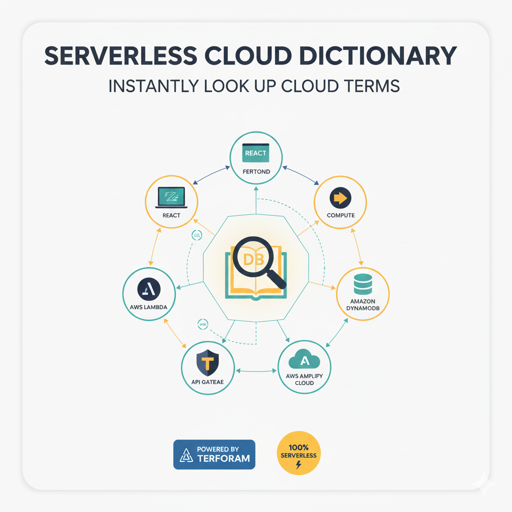
   
<strong>A Full-Stack Serverless Web Application for Instant Cloud Terminology Lookup</strong>

 

 
[![Infrastructure CI][ci-shield]][ci-url]
[![Production Deployment][cd-shield]][cd-url]
[![Update Documentation][docs-shield]][docs-url]

 

<a href="#about-the-project"><strong>Explore the docs »</strong></a>

   
Table of Contents

   <ol>
      <li><a href="#about-the-project">About The Project</a></li>
      <li><a href="#built-with">Built With</a></li>
      <li><a href="#use-cases">Use Cases</a></li>
      <li><a href="#architecture">Architecture</a></li>
      <li><a href="#file-structure">File Structure</a></li>
      <li><a href="#technical">Technical Reference</a></li>
      <li><a href="#getting-started">Getting Started</a></li>
      <li><a href="#gitops">GitOps & CI/CD Workflow</a></li>
      <li><a href="#usage">Usage</a></li>
      <li><a href="#roadmap">Roadmap</a></li>
      <li><a href="#challenges-faced">Challenges</a></li>
      <li><a href="#well-architected">Well Architected Framework</a></li>
      <li><a href="#acknowledgements">Acknowledgements</a></li>
   </ol>

<h2 id="about-the-project">About The Project</h2>

 The <strong>Serverless Cloud Dictionary</strong> is a modern, end-to-end cloud application designed to demonstrate the power of <strong>event-driven architecture</strong> and <strong>Infrastructure as Code (Terraform)</strong>. It provides users with a lightning-fast React interface to search for technical cloud terms, backed by a highly available NoSQL database and a serverless API. 

 This project automates the entire CI/CD lifecycle. When infrastructure changes occur (like API updates), a <strong>custom Terraform trigger</strong> fires a webhook to <strong>AWS Amplify</strong>, ensuring the frontend is always perfectly synced with the backend without manual redeployments. 

<a href="#readme-top">↑ Back to Top</a>

<h2 id="built-with">Built With</h2>

    
    
    
    
    
    

<ul>
   <li><strong>React.js:</strong> Frontend UI with dynamic title updates and normalized search logic.</li>
   <li><strong>AWS Lambda:</strong> Serverless Python backend that handles business logic and database queries with comprehensive CloudWatch logging.</li>
   <li><strong>Terraform:</strong> Orchestrates the entire AWS stack, including IAM roles, logging, and webhooks.</li>
   <li><strong>Amazon DynamoDB:</strong> NoSQL database storing cloud terms with <strong>Point-in-Time Recovery (PITR)</strong> enabled for data safety.</li>
   <li><strong>AWS Amplify:</strong> Hosts the frontend and manages automatic CI/CD pipelines via GitHub integration.</li>
   <li><strong>Amazon API Gateway:</strong> Acts as the secure entry point for the frontend to communicate with the Lambda backend.</li>
</ul>

<a href="#readme-top">↑ Back to Top</a>

<h2 id="use-cases">Use Cases</h2>
<ul>
   <li><strong>Developer Onboarding:</strong> A quick-reference tool for new engineers to learn internal or cloud-specific terminology.</li>
   <li><strong>CI/CD Pattern Template:</strong> A reference architecture for triggering frontend builds based on infrastructure changes.</li>
   <li><strong>Serverless Learning:</strong> A perfect project to understand CORS, IAM least-privilege, and NoSQL data normalization.</li>
</ul>

<a href="#readme-top">↑ Back to Top</a>

<h2 id="architecture">Architecture</h2>
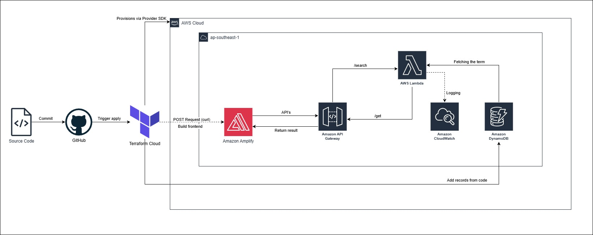

The architecture utilizes Terraform Cloud as the remote execution engine. Upon a successful apply, a local-exec provisioner sends a secure webhook to AWS Amplify. This bridges the gap between the backend infrastructure (API Gateway/Lambda) and the React frontend, ensuring that the latest REACT_APP_API_URL is injected into the production build immediately.

The null_resource trigger ensures that any infrastructure-level changes to the API Gateway endpoint are automatically propagated to the React frontend via a secure Webhook POST request, maintaining a zero-manual-intervention CI/CD pipeline.

<ol>
    <li><strong>Request:</strong> User enters a term in the React UI.</li>
    <li><strong>Normalization:</strong> Both Frontend and Lambda convert input to UPPERCASE to ensure case-insensitive matching against the database.</li>
    <li><strong>Route:</strong> API Gateway forwards the GET request to the Lambda function.</li>
    <li><strong>Fetch:</strong> Lambda queries DynamoDB using the "Term" Partition Key.</li>
    <li><strong>Build Trigger:</strong> Terraform uses a null_resource and curl to trigger an Amplify build whenever the API URL changes.</li>
</ol>

<a href="#readme-top">↑ Back to Top</a>

<h2 id="file-structure">File Structure</h2>
<pre>aws-terraform-cloud-dictionary/
aws-terraform-cloud-dictionary/
├── 📁 .github/                        # GitHub Action workflows for CI/CD
│   └── workflows/                     # CI/CD Pipeline Definitions
│       ├── cd.yml                     # Production Deployment (OIDC + S3 Sync)
│       ├── ci.yml                     # Terraform PR Insights (Checkov, TFLint, Plan)
│       └── documentation.yml          # Automated Documentation Sync via terraform-docs
├── 📁 .terraform/                     # Terraform working directory
├── 📁 assets/                         # Project documentation (diagrams, covers)
├── 📁 frontend/                       # React.js web application
│   ├── 📁 node_modules/               # Frontend dependencies
│   ├── 📁 public/                     # Static assets (favicon, index.html)
│   ├── 📁 src/                        # React source code
│   │   ├── App.css                    # Styling for the dictionary UI
│   │   ├── App.js                     # Main logic for search and API calls
│   │   ├── index.css                  # Global base styles
│   │   └── index.js                   # React entry point
│   ├── .gitignore                     # Frontend-specific git ignore rules
│   ├── package-lock.json              # Locked versions of npm dependencies
│   ├── package.json                   # Frontend scripts and dependency list
│   └── README.md                      # Frontend-specific documentation
├── 📁 lambda/                         # Serverless backend source
│   └── index.py                        # Python handler for DynamoDB queries
├── 📁 modules/                        # Modularized Terraform components
│   ├── 📁 api/                        # API Gateway resources
│   ├── 📁 app/                        # Amplify frontend resources
│       └── amplify.yml                # Amplify build specification
│   ├── 📁 database/                   # DynamoDB table & seeding logic
│   └── 📁 lambda/                     # Lambda function & IAM policies
│       └── 📁 lambda/                 # Serverless backend logic
│           ├── index.py               # Python script for dictionary search logic
│           └── lambda_function.zip    # Deployment package created by Terraform
│       ├── main.tf                    # Module-specific resources
│       ├── outputs.tf                 # Values exported to the root
│       ├── providers.tf               # Version constraints (No cloud block!)
│       └── variables.tf               # Module inputs
├── main.tf                            # Module configurations
├── outputs.tf                         # CloudFront and API Gateway URLs for the user
├── providers.tf                       # Terraform Cloud backend & version constraints
├── variables.tf                       # Configurable project inputs (AWS Region, Tags)
├── .pre-commit-config.yaml            # Local git-hook orchestration
├── .tflint.hcl                        # TFLint AWS ruleset configuration
├── .checkov.yml                       # Checkov scan ignore list
├── .terraform-docs.yml                # Config for terraform documentation during workflow
├── terraform.tfstate                  # Local state file (if not using cloud)
├── terraform.tfstate.backup           # Previous state snapshot
├── README.template.md                 # Documentation source template
└── README.md                          # Project documentation (Auto-injected by terraform-docs)
</pre>

<a href="#readme-top">↑ Back to Top</a>

<h2 id="getting-started">Getting Started</h2>
<h3>Prerequisites</h3>
<ul>
  <li>AWS CLI configured with Admin permissions.</li>
  <li>Terraform CLI installed / Terraform Cloud account registered.</li>
  <li><strong>Set your AWS Region:</strong> Set to whatever <code>aws_region</code> you want in <code>variables.tf</code>.</li>
</ul>

<h3>Terraform State Management</h3>

Select one:

<ol>
   <li>Terraform Cloud</li>
   <li>Terraform Local CLI</li>
</ol>

<h3>Terraform Cloud State Management</h3>
<ol>
   <li>Create a new <strong>Workspace</strong> with github version control workflow in Terraform Cloud.</li>
   <li>In the Variables tab, add the following <strong>Terraform Variables:</strong>
   </li>
   <li>
    Add the following <strong>Environment Variables</strong> (AWS Credentials):
    <ul>
      <li><code>AWS_ACCESS_KEY_ID</code></li>
      <li><code>AWS_SECRET_ACCESS_KEY</code></li>
   </ul>
   </li>
    <li>
      Run the command ni Terraform CLI:
      <pre>terraform login</pre>
    </li>
    <li>Create a token and follow the steps in browser to complete the Terraform Cloud Connection.</li>
    <li>
      Add the <code>backend</code> block in <code>terraform</code> code block</code>:
    <pre>backend "remote" {
  hostname     = "app.terraform.io"
  organization = &lt;your-organization-name&gt;
  workspaces {
    name = &lt;your-workspace-name&gt;
  }
}</pre>
   </li>
    <li>
      Run the command in Terraform CLI to migrate the state into Terraform Cloud:
      <pre>terraform init -migrate-state</pre>
    </li>
</ol>

<h3>Installation & Deployment</h3>
<ol>
    <li>
        <strong>Clone the Repository:</strong>
        <pre>git clone https://github.com/ShenLoong99/aws-terraform-cloud-dictionary.git</pre>
    </li>
    <li>
        <strong>Provision Infrastructure:</strong> 
        <strong>Terraform Cloud</strong> → <strong>Initialize & Apply:</strong> Push your code to GitHub. Terraform Cloud will automatically detect the change, run a <code>plan</code>, and wait for your approval.
    </li>
    <li>
      <strong>The Webhook Handshake:</strong> 
      Once you approve the plan, Terraform will create the backend. It will then automatically trigger the <strong>AWS Amplify Webhook</strong> to start the frontend build. 
      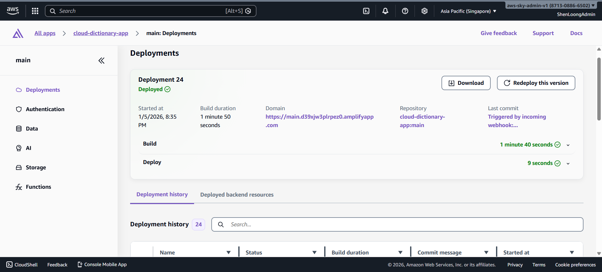
   </li>
    <li>
        <strong>Observe workflow:</strong> 
        <strong>GitHub (GitOps)</strong> → <strong>Github actions:</strong> Observe the process/workflow of CI/CD in the actions tab in GitHub.
    </li>
</ol>

<a href="#readme-top">↑ Back to Top</a>

<h3 id="database-seeding">🗄️ Database Seeding</h3>

    The infrastructure automatically populates <strong>30 core cloud computing terms</strong> into the DynamoDB table during the <code>terraform apply</code> process. This ensures the application is ready for immediate use upon deployment.

    Data is injected using the <code>aws_dynamodb_table_item</code> resource with a <code>for_each</code> loop, mapping terms to their definitions with automated <strong>UPPERCASE</strong> normalization to ensure consistent search hits.

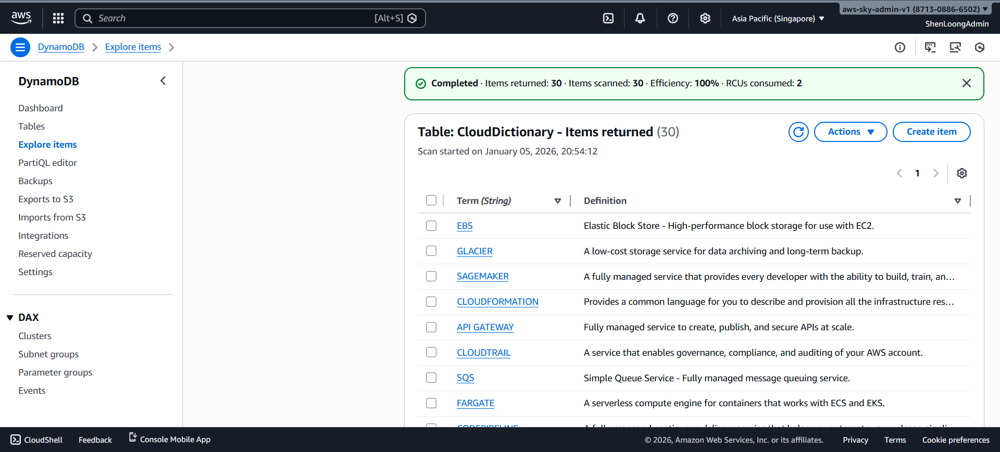

<a href="#readme-top">↑ Back to Top</a>

<h2 id="gitops">GitOps & CI/CD Workflow</h2>

This project uses a fully automated GitOps pipeline to ensure code quality and deployment reliability. The <strong>Pre-commit</strong> framework implements a "Shift-Left" strategy, ensuring that code is formatted, documented, and secure before it ever leaves your machine.

<h3>Workflow</h3>
<ol>
  <li>
    <strong>Branch Protection Rulesets</strong> 
    To ensure high code quality and prevent unauthorized changes to the production environment, the <code>main</code> branch is governed by a <strong>GitHub Branch Ruleset</strong>.
    <ul>
      <li><strong>Pull Request Mandatory:</strong> No code can be pushed directly to <code>main</code>. All changes must originate from a feature branch and be merged via a Pull Request.</li>
      <li><strong>Required Status Checks:</strong> The <code>Infrastructure CI</code> (Terraform Plan & Static Analysis) must pass successfully before a merge is permitted.</li>
      <li><strong>Bypass Authority:</strong> The dedicated GitHub App is added to the Bypass List with "Always allow" permissions. This allows the bot to push documentation updates directly to <code>main</code> without being blocked by PR requirements.</li>
    </ul>
  </li>
  <li>
    <strong>Pre-commit</strong>
    <ul>
      <li><strong>Tool:</strong> Executes <code>terraform fmt</code>, <code>terraform validate</code>, <code>TFLint</code>, <code>terraform_docs</code> and <code>checkov</code> to ensure the code is clean.</li>
      <li><strong>Trigger:</strong> Runs on every <strong>git commit</strong>.</li>
      <li>
        <strong>Outcome:</strong> If any check fails, the commit is blocked. You fix the error, re-add the file, and commit again.
      </li>
    </ul>
  </li>
  <li>
    <strong>Continuous Integration (PR)</strong>
    <ul>
      <li><strong>Tool:</strong> Executes <code>terraform fmt -check</code>, <code>terraform validate</code> and <code>checkov</code>, then do <code>plan</code> and cost estimation and print it on PR.</li>
      <li><strong>Trigger:</strong> Runs on every <strong>Pull Request</strong>.</li>
      <li>
        <strong>Outcome:</strong> This acts as the "Gatekeeper" before code is merged to <code>main</code>.
      </li>
    </ul>
  </li>
  <li>
    <strong>Continuous Delivery (Deployment)</strong>
    <ul>
      <li><strong>Tool:</strong> Terraform Cloud + GitHub Actions OIDC.</li>
      <li><strong>Trigger:</strong> Merges to the <code>main</code> branch.</li>
      <li>
        <strong>Outcome:</strong> The pipeline verifies the infrastructure state and runs a post-deployment health check.
      </li>
    </ul>
  </li>
  <li>
    <strong>Dynamically update readme documentation</strong>
    <ul>
      <li><strong>Tool:</strong> <code>terraform_docs</code> + GitHub Actions.</li>
      <li><strong>Trigger:</strong> Merges to the <code>main</code> branch.</li>
      <li>
        <strong>Outcome:</strong> The pipeline verifies the infrastructure state from Terraform Cloud, retrieve outputs from Terraform Cloud and update the readme documentation file dynamically.
      </li>
    </ul>
  </li>
</ol>

<h3>Prerequisites for GitOps</h3>
<ul>
  <li><strong>Repository Secret <code>TF_API_TOKEN</code>:</strong> Required for GitHub to communicate with Terraform Cloud.</li>
  <li><strong>Trigger:</strong> A GitHub Actions OIDC role (<code>GitHubActionRole</code>) allows the runner to verify AWS resources without long-lived keys.</li>
  <li>
      <strong>Automated Documentation via GitHub App:</strong> Instead of using a Personal Access Token (PAT) or the default <code>GITHUB_TOKEN</code>, this project uses a custom <strong>GitHub App</strong> for automated tasks. 
      <table>
         <thead>
            <tr>
               <td>Secret</td>
               <td>Description</td>
               <td>Source</td>
            </tr>
         </thead>
         <tbody>
            <tr>
               <td><code>BOT_APP_ID</code></td>
               <td>The unique numerical ID assigned to GitHub App.</td>
               <td>App Settings > General</td>
            </tr>
            <tr>
               <td><code>BOT_PRIVATE_KEY</code></td>
               <td>The full content of the generated <code>.pem</code> private key file.</td>
               <td>App Settings > Private keys</td>
            </tr>
         </tbody>
      </table>
   </li>
</ul>

<a href="#readme-top">↑ Back to Top</a>

<h2 id="usage">🧪 Usage & Testing</h2>

 To verify the end-to-end functionality of the pipeline, follow these testing steps: 

<ol>
   <li>
        <strong>Access the App:</strong> Use the Amplify URL provided in the Terraform outputs. 
        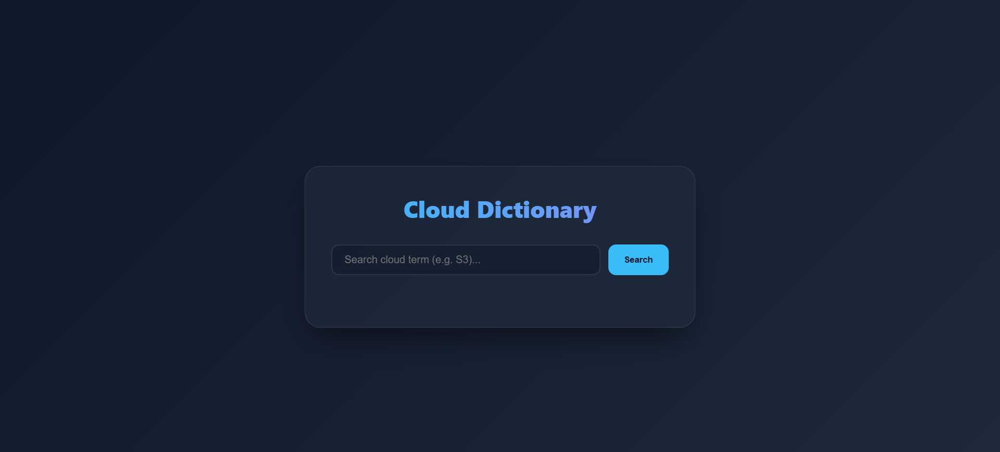
   </li>
   <li>
        <strong>Test Existing Terms:</strong> Search for any of the 35 pre-loaded terms (e.g., <code>S3</code>, <code>EC2</code>, or <code>NAT Gateway</code>). The app will return the definition and update the browser tab title. 
        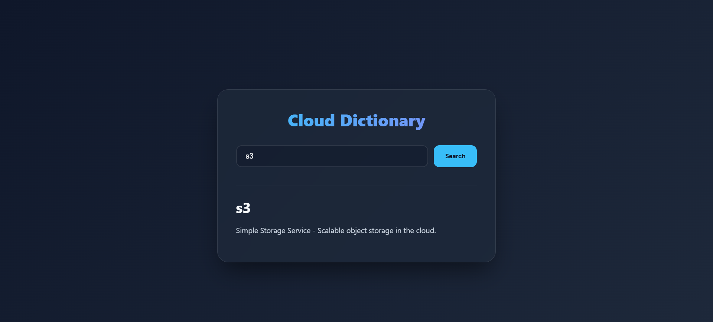 
        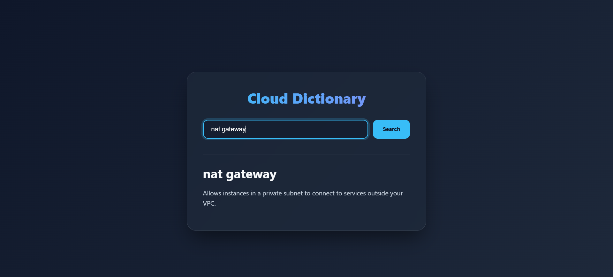
    </li>
   <li>
        <strong>Case-Insensitivity Check:</strong> Try searching for <code>s3</code> (lowercase) or <code>nAt GaTeWaY</code> (mixed case). The system will normalize these to match the database records.
    </li>
    <li>
        <strong>Error Handling:</strong> Search for a term that does <strong>not</strong> exist in the dictionary (e.g., <code>Windows 95</code>).
        <ul>
            <li>
                <strong>Frontend Behavior:</strong> The UI will display a "Term not found" message within a styled error box. 
                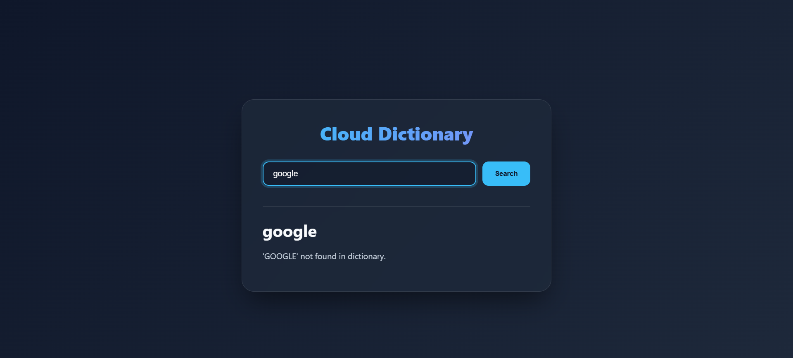 
                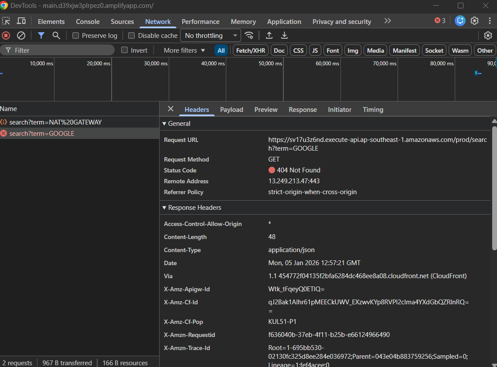
                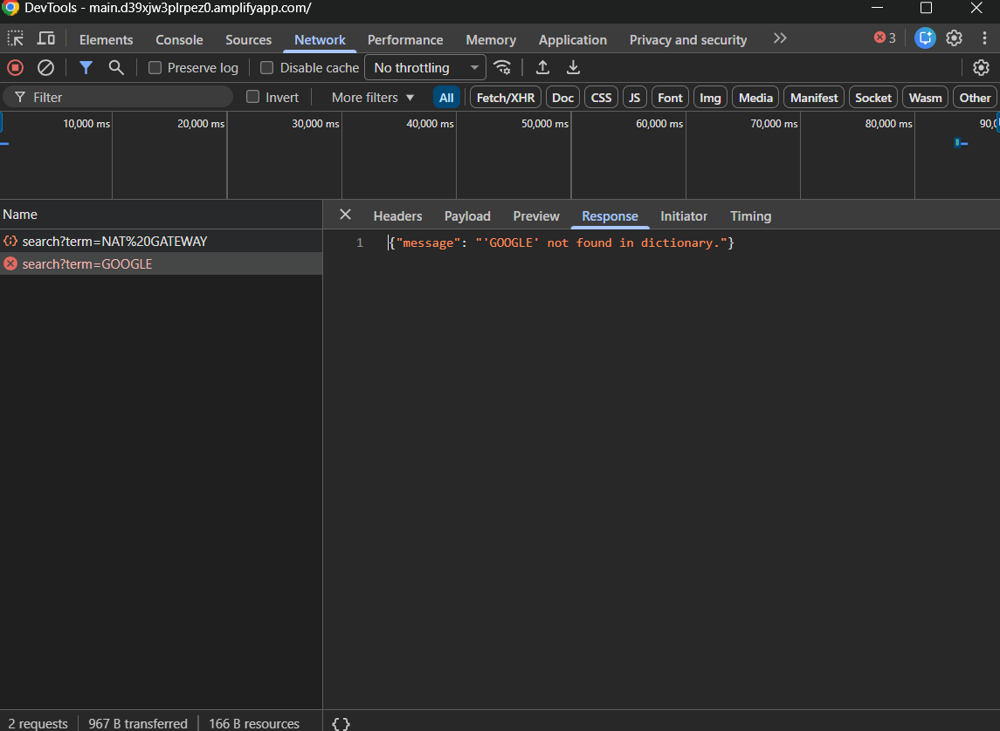
            </li>
            <li><strong>Backend Behavior:</strong> The Lambda function will catch the missing item and return a <code>404 Not Found</code> status code to the client.</li>
        </ul>
    </li>
   <li>
        <strong>Verify Logs:</strong> Check <strong>CloudWatch Log Groups</strong> at <code>/aws/lambda/CloudDictionaryHandler</code> to see the search execution path and hits/misses. 
         
        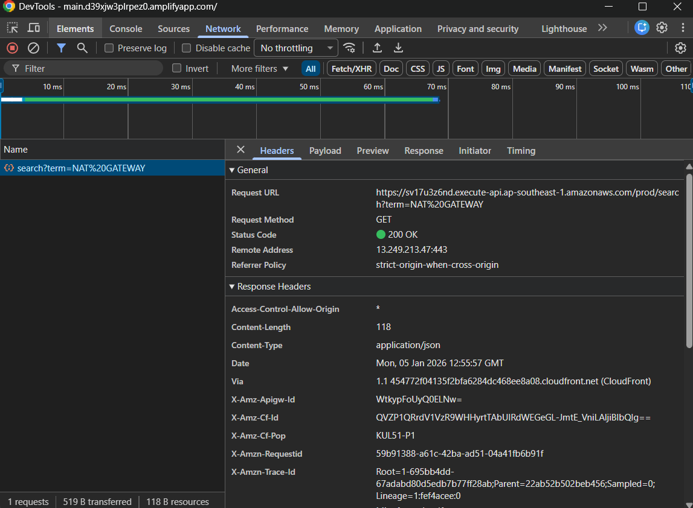
        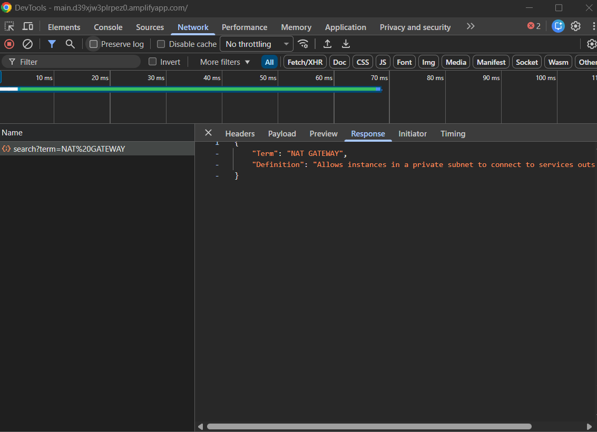
    </li>
</ol>

<a href="#readme-top">↑ Back to Top</a>

<h2 id="roadmap">Roadmap</h2>
<ul>
   <li>[x] <strong>Data Normalization:</strong> Implemented upper() conversion in Terraform and Python.</li>
   <li>[x] <strong>Disaster Recovery:</strong> Enabled Point-in-Time Recovery for DynamoDB.</li>
   <li>[x] <strong>Logging:</strong> Added detailed CloudWatch logging for search debugging.</li>
   <li>[ ] <strong>Fuzzy Search:</strong> Implement DynamoDB Scan with FilterExpressions for partial word matching.</li>
   <li>[ ] <strong>Auth:</strong> Add Amazon Cognito for private dictionary access.</li>
</ul>

<a href="#readme-top">↑ Back to Top</a>

<h2 id="challenges">Challenges</h2>
<table>
   <thead>
      <tr>
         <th>Challenge</th>
         <th>Solution</th>
      </tr>
   </thead>
   <tbody>
      <tr>
         <td><strong>Case Sensitivity</strong></td>
         <td>Standardized all database keys and queries to UPPERCASE using Terraform's <code>upper()</code> and Python's <code>.upper()</code>.</td>
      </tr>
      <tr>
         <td><strong>Amplify De-sync</strong></td>
         <td>Created a <code>null_resource</code> with a <code>timestamp()</code> trigger to force-execute a <code>curl</code> webhook whenever infrastructure changes.</td>
      </tr>
      <tr>
         <td><strong>CORS Errors</strong></td>
         <td>Configured explicit <code>Access-Control-Allow-Origin</code> headers in the Lambda response and API Gateway.</td>
      </tr>
   </tbody>
</table>

<a href="#readme-top">↑ Back to Top</a>

<h2 id="well-architected">🏛️ AWS Well-Architected Framework Alignment</h2>

  This project is built following the six pillars of the <strong>AWS Well-Architected Framework</strong>, ensuring a professional, scalable, and secure cloud-native application.

<table>
   <thead>
   <tr>
      <th>Pillar</th>
      <th>Project Implementation Details</th>
   </tr>
   </thead>
   <tbody>
   <tr>
      <td><strong>1. Operational Excellence</strong></td>
      <td>
         <ul>
         <li><strong>Infrastructure as Code (IaC):</strong> The entire stack is provisioned via Terraform, allowing for consistent and repeatable deployments.</li>
         <li><strong>Automated CI/CD:</strong> Integrated AWS Amplify with GitHub for automated frontend builds and a <code>null_resource</code> trigger to sync backend changes.</li>
         <li><strong>Observability:</strong> Configured dedicated CloudWatch Log Groups for the Lambda function with custom retention periods.</li>
         </ul>
      </td>
   </tr>
   <tr>
      <td><strong>2. Security</strong></td>
      <td>
         <ul>
         <li><strong>Least Privilege:</strong> IAM roles are scoped specifically to the resources required (e.g., Lambda only has <code>GetItem</code> access to the Dictionary table).</li>
         <li><strong>Identity & Access Management:</strong> API Gateway uses IAM permissions for Lambda invocation, ensuring no unauthorized triggers.</li>
         <li><strong>Data Protection:</strong> DynamoDB tables are private within the AWS environment, accessible only through the secure API layer.</li>
         </ul>
      </td>
   </tr>
   <tr>
      <td><strong>3. Reliability</strong></td>
      <td>
         <ul>
         <li><strong>Managed Services:</strong> Utilizes serverless services (DynamoDB, Lambda) which offer built-in high availability across Multiple Availability Zones.</li>
         <li><strong>Data Recovery:</strong> Enabled <strong>Point-in-Time Recovery (PITR)</strong> for DynamoDB to protect against accidental deletions or data corruption.</li>
         <li><strong>Zero-Touch Failover:</strong> AWS Amplify provides automatic failover for the frontend hosting.</li>
         </ul>
      </td>
   </tr>
   <tr>
      <td><strong>4. Performance Efficiency</strong></td>
      <td>
         <ul>
         <li><strong>Serverless Scaling:</strong> Lambda and API Gateway scale automatically to handle incoming request spikes without manual intervention.</li>
         <li><strong>Optimized Storage:</strong> DynamoDB provides single-digit millisecond latency for term lookups.</li>
         <li><strong>Global Content Delivery:</strong> AWS Amplify deploys the React frontend to a global CDN for low-latency user access.</li>
         </ul>
      </td>
   </tr>
   <tr>
      <td><strong>5. Cost Optimization</strong></td>
      <td>
         <ul>
         <li><strong>On-Demand Scaling:</strong> DynamoDB set to <code>PAY_PER_REQUEST</code> to eliminate costs during idle time.</li>
         <li><strong>Log Retention:</strong> CloudWatch logs are capped at 7 days to prevent storage cost accumulation.</li>
         <li><strong>Memory Tuning:</strong> Lambda function restricted to 128MB (minimal cost) since the search logic is lightweight.</li>
         <li><strong>Pay-as-you-go:</strong> Using <code>PAY_PER_REQUEST</code> billing for DynamoDB and sub-second billing for Lambda eliminates idle resource costs.</li>
         <li><strong>Log Retention:</strong> Automatic expiration of CloudWatch logs after 7 days prevents long-term storage cost accumulation.</li>
         <li><strong>Right-Sizing:</strong> Lambda is configured with minimal memory (128MB) to optimize for the project's specific compute needs.</li>
         </ul>
      </td>
   </tr>
   <tr>
      <td><strong>6. Sustainability</strong></td>
      <td>
         <ul>
         <li><strong>Resource Minimization:</strong> By utilizing Serverless architecture, we maximize resource utilization and minimize the carbon footprint associated with idle server capacity.</li>
         <li><strong>Managed Infrastructure:</strong> Offloading the physical infrastructure management to AWS reduces energy waste through highly optimized data center operations.</li>
         </ul>
      </td>
   </tr>
   </tbody>
</table>

<a href="#readme-top">↑ Back to Top</a>

<h2 id="acknowledgements">Acknowledgements</h2>

  Special thanks to <strong>Tech with Lucy</strong> for the architectural inspiration and excellent AWS tutorials that helped shape this pipeline.

<ul>
  <li>
    See her youtube channel here: <a href="https://www.youtube.com/@TechwithLucy" target="_blank">Tech With Lucy</a>
  </li>
  <li>
    Watch her video here: <a href="https://www.youtube.com/watch?v=0hJxcBdRlYw" target="_blank">5 Intermediate AWS Cloud Projects To Get You Hired (2025)</a>
  </li>
</ul>

<a href="#readme-top">↑ Back to Top</a>

[contributors-shield]: https://img.shields.io/github/contributors/aws-terraform-cloud-dictionary.svg?style=for-the-badge
[contributors-url]: https://github.com/aws-terraform-cloud-dictionary/graphs/contributors
[forks-shield]: https://img.shields.io/github/forks/aws-terraform-cloud-dictionary.svg?style=for-the-badge
[forks-url]: https://github.com/aws-terraform-cloud-dictionary/network/members
[stars-shield]: https://img.shields.io/github/stars/aws-terraform-cloud-dictionary.svg?style=for-the-badge
[stars-url]: https://github.com/aws-terraform-cloud-dictionary/stargazers
[issues-shield]: https://img.shields.io/github/issues/aws-terraform-cloud-dictionary.svg?style=for-the-badge
[issues-url]: https://github.com/aws-terraform-cloud-dictionary/issues
[license-shield]: https://img.shields.io/github/license/aws-terraform-cloud-dictionary.svg?style=for-the-badge
[license-url]: https://github.com/aws-terraform-cloud-dictionary/blob/master/LICENSE.txt
[linkedin-shield]: https://img.shields.io/badge/-LinkedIn-black.svg?style=for-the-badge&logo=linkedin&colorB=555
[linkedin-url]: https://linkedin.com/in/si-kai-tan

<!-- BEGIN_TF_DOCS -->

## Requirements

| Name                                                                     | Version |
| ------------------------------------------------------------------------ | ------- |
|  [terraform](#requirement_terraform) | >= 1.5  |
|  [archive](#requirement_archive)       | ~> 2.0  |
|  [aws](#requirement_aws)                   | ~> 5.0  |
|  [null](#requirement_null)                | ~> 3.0  |

## Modules

| Name                                                        | Source             | Version |
| ----------------------------------------------------------- | ------------------ | ------- |
|  [api](#module_api)                | ./modules/api      | n/a     |
|  [app](#module_app)                | ./modules/app      | n/a     |
|  [database](#module_database) | ./modules/database | n/a     |
|  [lambda](#module_lambda)       | ./modules/lambda   | n/a     |

## Resources

| Name                                                                                                                                                         | Type     |
| ------------------------------------------------------------------------------------------------------------------------------------------------------------ | -------- |
| [aws_api_gateway_account.main](https://registry.terraform.io/providers/hashicorp/aws/latest/docs/resources/api_gateway_account)                              | resource |
| [aws_iam_role.api_gateway_logging](https://registry.terraform.io/providers/hashicorp/aws/latest/docs/resources/iam_role)                                     | resource |
| [aws_iam_role_policy_attachment.api_gateway_logging](https://registry.terraform.io/providers/hashicorp/aws/latest/docs/resources/iam_role_policy_attachment) | resource |

## Inputs

| Name                                                                  | Description                                       | Type     | Default            | Required |
| --------------------------------------------------------------------- | ------------------------------------------------- | -------- | ------------------ | :------: |
|  [aws_region](#input_aws_region)       | The AWS region to deploy resources in             | `string` | `"ap-southeast-1"` |    no    |
|  [github_token](#input_github_token) | GitHub token for Amplify to access the repository | `string` | n/a                |   yes    |

## Outputs

| Name                                                                                         | Description                             |
| -------------------------------------------------------------------------------------------- | --------------------------------------- |
|  [amplify_app_id](#output_amplify_app_id)                | ID of the Amplify App                   |
|  [amplify_app_url](#output_amplify_app_url)             | The URL of the hosted React application |
|  [amplify_branch_name](#output_amplify_branch_name) | The name of the deployed branch         |
|  [api_endpoint](#output_api_endpoint)                      | The URL of the API Gateway stage        |
|  [api_invoke_url](#output_api_invoke_url)                | The invoke URL of the API Gateway stage |
|  [aws_region](#output_aws_region)                            | The AWS region to deploy resources in   |
|  [dynamodb_table_name](#output_dynamodb_table_name) | Name of the DynamoDB dictionary table   |

<!-- END_TF_DOCS -->
